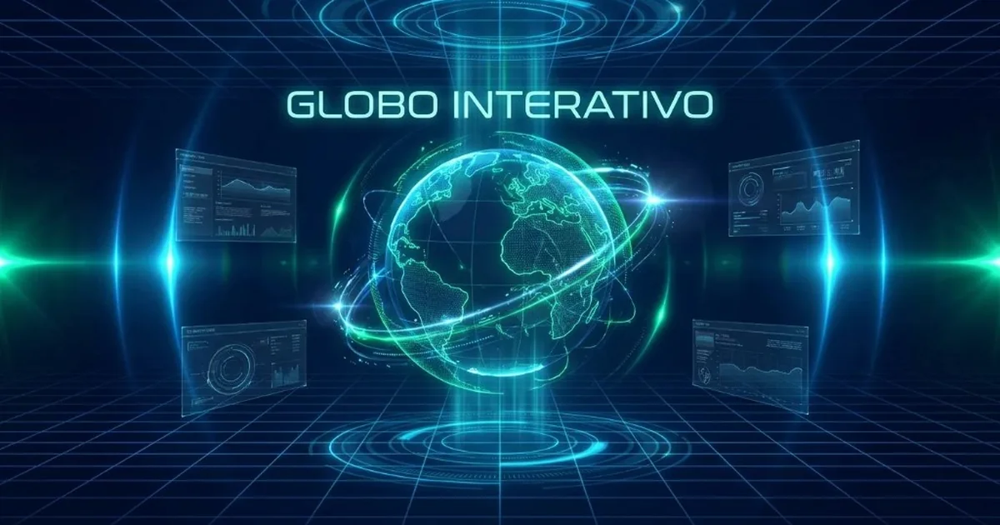

<p align="center">
  
</p>

<h1 align="center">🌍 Globo Interativo</h1>

<p align="center">
  <strong>Visualização planetária 3D em tempo real para educação, geografia e formação cidadã</strong>
</p>

<p align="center">
  <a href="https://globo.educar.workers.dev"></a>
  <a href="LICENSE"></a>
  <a href="https://diegoduenhas.com.br"></a>
</p>

---

## 📖 Sobre o projeto

O **Globo Interativo** é uma aplicação web que coloca o planeta Terra nas mãos de estudantes, educadores e curiosos — literalmente. Em um globo 3D navegável, é possível explorar **fronteiras políticas**, **fusos horários**, **trópicos e equador**, **cabos submarinos**, **rotas de dados**, **satélites** e **dossiês detalhados de cada país**, com estatísticas demográficas atualizadas em tempo real.

A interface adota uma estética **high-tech / HUD**, pensada para estimular o engajamento visual de jovens e adultos, sem sacrificar rigor geográfico. O projeto é **100% gratuito**, roda no navegador (sem instalação) e foi concebido como **ferramenta didática** alinhada à **BNCC** — especialmente aos componentes de **Geografia** e **Computação (BNCC Tecnologia)**.

> 🌐 **Acesse agora:** [globo.educar.workers.dev](https://globo.educar.workers.dev)

---

## ✨ Funcionalidades

| Camada | Ícone | Descrição |
|--------|:-----:|-----------|
| **Globo 3D** | 🌐 | Terra texturizada com rotação, zoom e navegação orbital |
| **Fronteiras** | ▢ | Limites políticos de ~195 países (Natural Earth) |
| **Nomes** | ⬡ | Rótulos com nomes dos países em português |
| **Fusos horários** | ⌚ | Meridianos UTC a cada 15° com hora local ao vivo |
| **Trópicos e Equador** | ≡ | Paralelos do Equador, Câncer e Capricórnio |
| **Cabos submarinos** | ≋ | 700+ rotas reais de telecomunicações submarinas |
| **Arcos de dados** | ⤳ | Fluxos ilustrativos entre grandes polos digitais |
| **Satélites** | ✦ | Constelações artificiais em órbita |
| **Dia / Noite** | ◐ | Terminador solar em tempo real (shader dinâmico) |
| **Modo noite** | ☾ | Textura noturna com luzes urbanas |
| **Dossiê do país** | 📋 | População, capital, idiomas, fusos IANA, bandeira e resumo da Wikipédia |
| **Busca** | 🔍 | Localização rápida de países por nome (com acentos PT-BR) |
| **Estatísticas ao vivo** | 📊 | Nascimentos, óbitos e crescimento populacional estimados |

---

## 🎓 Função didática e alinhamento curricular

### Por que um globo digital?

A geografia não se aprende apenas com mapas planos. A **visualização esférica** desenvolve:

- **Noção de escala** — distâncias, áreas e densidade populacional ganham proporção real
- **Consciência espacial** — latitude, longitude, hemisférios e fusos horários deixam de ser abstrações
- **Pensamento sistêmico** — cabos submarinos, rotas de dados e satélites conectam geografia física à **geografia digital**
- **Formação cidadã** — compreender fronteiras, diversidade cultural e interdependência global

Ferramentas digitais interativas reduzem a **barreira de acesso** a atlas caros, globos físicos frágeis e mapas desatualizados — especialmente relevante em escolas públicas e comunidades com recursos limitados.

### Alinhamento com a BNCC — Geografia

| Código / Campo | Competência / Habilidade | Como o Globo Interativo contribui |
|----------------|--------------------------|-----------------------------------|
| **EF06GE01** | Compreender o conceito de espaço geográfico | Navegação 3D com coordenadas LAT/LON em tempo real |
| **EF07GE01** | Problematizar preconceitos vinculados a generalizações | Dossiês individuais por país combatem estereótipos |
| **EF08GE01** | Descrever processos de formação territorial | Fronteiras políticas e comparação de áreas |
| **EF08GE04** | Compreender fluxos populacionais | Estatísticas de nascimentos, óbitos e crescimento |
| **EF08GE10** | Identificar problemas ambientais globais | Camada dia/noite e consciência planetária |
| **EF08GE18** | Elaborar mapas temáticos | Múltiplas camadas sobrepostas (fusos, trópicos, cabos) |
| **EF09GE01** | Compreender dinâmicas de globalização | Cabos submarinos e arcos de conectividade |
| **EF09GE03** | Analisar fluxos de informação e capital | Rotas de dados e infraestrutura digital |
| **EM13CHS201** | Analisar processos de territorialização | Seleção de países com dados demográficos e culturais |

### Alinhamento com a BNCC — Computação (Tecnologia e Inovação)

| Eixo / Prática | Relação com o projeto |
|----------------|----------------------|
| **Pensamento computacional** | Camadas modulares, estados ON/OFF, busca e filtros |
| **Cultura digital** | Compreensão de infraestrutura global (cabos, satélites, IXPs) |
| **Mundo digital** | Visualização de redes físicas que sustentam a internet |
| **Ciência de dados** | Estatísticas populacionais, séries temporais e APIs abertas |
| **Tecnologia e sociedade** | Debate sobre desigualdade digital, conectividade e cidadania |

---

## 🧠 Importância técnica e social

### Acesso democrático ao conhecimento geográfico

Globos físicos de qualidade são caros; mapas mural impressos envelhecem; softwares proprietários exigem licenças. Uma aplicação **open source**, hospedada na **edge cloud** (Cloudflare Workers), carrega em segundos em qualquer dispositivo com navegador moderno — celular, tablet, Chromebook ou laboratório de informática.

### Dados abertos como princípio pedagógico

O projeto **não inventa dados**: integra bases reconhecidas internacionalmente (Natural Earth, TeleGeography, World Bank, Wikipedia, dr5hn). Isso ensina, na prática, que **informação confiável tem fonte** — competência essencial na era da desinformação.

### Interatividade e retenção

Estudos em educação digital indicam que **aprendizagem ativa** (explorar, clicar, comparar) supera passividade em retenção de conteúdo. O globo transforma o aluno de receptor em **investigador geográfico**.

### Cidadania global

Compreender fusos horários ajuda a respeitar ritmos de outras culturas; ver cabos submarinos revela a **fragilidade e a maravilha** da internet; explorar dossiês de países cultiva **empatia intercultural** — pilares de uma cidadania digital responsável.

---

## 🛠️ Stack tecnológica

| Tecnologia | Versão / Uso |
|------------|--------------|
| [Three.js](https://threejs.org/) | 0.160 — renderização WebGL |
| [globe.gl](https://github.com/vasturiano/globe.gl) | 2.34 — globo 3D interativo |
| [solar-calculator](https://github.com/shashwatak/solar-calculator) | 0.3 — posição solar / terminador |
| [Cloudflare Workers](https://workers.cloudflare.com/) | Hospedagem edge + assets estáticos |
| [Wrangler](https://developers.cloudflare.com/workers/wrangler/) | Deploy e CI |
| HTML5 / CSS3 / ES Modules | Interface HUD responsiva |
| Python + Pillow | Geração da imagem Open Graph |

---

## 📚 Fontes de dados e créditos

Todas as bases externas são utilizadas conforme suas licenças originais. Agradecemos aos mantenedores:

| Fonte | Dado utilizado | Licença / Link |
|-------|----------------|----------------|
| **[Natural Earth](https://www.naturalearthdata.com/)** via [globe.gl](https://github.com/vasturiano/globe.gl) | Fronteiras políticas (110m) | [Public Domain](https://www.naturalearthdata.com/about/terms-of-use/) |
| **[mledoze/countries](https://github.com/mledoze/countries)** | Metadados: capital, idioma, moeda, área | [ODbL / MIT](https://github.com/mledoze/countries) |
| **[dr5hn/countries-states-cities](https://github.com/dr5hn/countries-states-cities-database)** | Fusos horários IANA por país | [ODbL 1.0](https://github.com/dr5hn/countries-states-cities-database) |
| **[TeleGeography](https://www.submarinecablemap.com/)** | Cabos submarinos (GeoJSON) | [CC BY-NC-SA 3.0](https://creativecommons.org/licenses/by-nc-sa/3.0/) |
| **[NASA Blue Marble / Black Marble](https://visibleearth.nasa.gov/)** via three-globe | Texturas diurna e noturna da Terra | [Public Domain (NASA)](https://www.nasa.gov/nasa-brand-center/images-and-media/) |
| **[World Bank Open Data](https://data.worldbank.org/)** | População mundial (SP.POP.TOTL) | [CC BY 4.0](https://datacatalog.worldbank.org/public-licenses#cc-by) |
| **[Wikipedia PT](https://pt.wikipedia.org/)** (REST API) | Resumos enciclopédicos por país | [CC BY-SA 3.0](https://creativecommons.org/licenses/by-sa/3.0/) |
| **[flagcdn.com](https://flagcdn.com/)** | Bandeiras SVG/PNG | Uso público de bandeiras nacionais |
| **[Roboto](https://fonts.google.com/specimen/Roboto)** via @compai/font-roboto | Fonte 3D para rótulos (acentos PT) | [Apache 2.0](https://www.apache.org/licenses/LICENSE-2.0) |
| **[Share Tech Mono](https://fonts.google.com/specimen/Share+Tech+Mono)** / **[Orbitron](https://fonts.google.com/specimen/Orbitron)** | Tipografia da interface HUD | [Open Font License](https://scripts.sil.org/OFL) |
| **Estimativas demográficas** | Nascimentos (~134M/ano) e óbitos (~61M/ano) | ONU / World Population Prospects (referência) |

> ⚠️ **Nota sobre cabos submarinos:** os dados TeleGeography são licenciados sob **CC BY-NC-SA 3.0** — uso educacional e não comercial permitido, com atribuição. Consulte a licença antes de usos comerciais.

---

## 🚀 Instalação e deploy local

### Pré-requisitos

- [Node.js](https://nodejs.org/) 18+
- Conta [Cloudflare](https://dash.cloudflare.com/) (para deploy)

### Desenvolvimento

```bash
git clone https://github.com/dduenhas/globo-interativo.git
cd globo-interativo
npm install
npx wrangler dev
```

Abra o endereço local indicado pelo Wrangler (geralmente `http://localhost:8787`).

### Deploy em produção

```bash
# Sincronize arquivos-fonte para public/ (se editou na raiz)
cp app.js styles.css index.html public/

# Gere imagem Open Graph (opcional, após alterações visuais)
python scripts/generate-og-image.py

# Deploy
npm run deploy
```

### Estrutura do repositório

```
globo-interativo/
├── app.js              # Lógica principal (fonte)
├── index.html          # HTML + meta tags Open Graph
├── styles.css          # Estilos HUD
├── public/             # Assets servidos pelo Cloudflare Workers
│   ├── app.js
│   ├── index.html
│   ├── styles.css
│   ├── og-image.webp   # Preview WhatsApp / redes sociais (66 KB)
│   ├── og-image.jpg    # Fallback JPEG para crawlers legados
│   └── data/
│       └── cable-geo.json
├── scripts/
│   └── generate-og-image.py
├── wrangler.jsonc      # Configuração Cloudflare Workers
├── LICENSE             # MIT
└── README.md
```

---

## 📱 Compartilhamento (WhatsApp, redes sociais)

O projeto inclui **meta tags Open Graph** e uma imagem de preview (`og-image.webp`, 1200×630 px, ~66 KB) para exibir título, descrição e miniatura ao compartilhar o link:

- **Título:** Globo Interativo — Conheça o Planeta em Tempo Real
- **Descrição:** Visualização 3D interativa da Terra com camadas geográficas, dados ao vivo e dossiês de países.

Para regenerar a imagem de preview:

```bash
python scripts/generate-og-image.py
```

---

## 🤝 Contribuindo

Contribuições são bem-vindas! Abra uma [issue](https://github.com/dduenhas/globo-interativo/issues) para reportar bugs ou sugerir melhorias, ou envie um Pull Request.

Áreas de interesse:

- Traduções (EN, ES)
- Modo offline / PWA
- Camadas adicionais (clima, biomas, relevo)
- Integração com LMS (Google Classroom, Moodle)

---

## 📄 Licença

Este projeto está licenciado sob a [Licença MIT](LICENSE) — Copyright © 2026 [Diego Duenhas](https://diegoduenhas.com.br).

---

<p align="center">
  Desenvolvido por <a href="https://diegoduenhas.com.br">Diego Duenhas</a>
  · <a href="https://github.com/dduenhas/globo-interativo">GitHub</a>
  · <a href="https://globo.educar.workers.dev">Demo ao vivo</a>
</p>

<p align="center">
  <sub>🌍 “A geografia não descreve apenas onde estamos — revela quem somos no mundo.”</sub>
</p>
